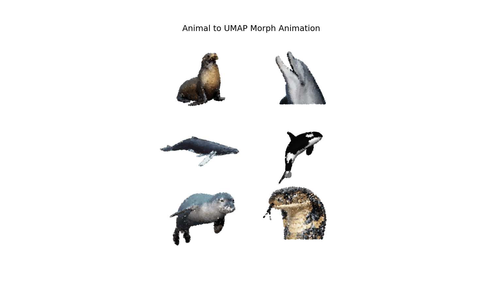

# Proteome Visualizer with AI Agent

Proteomics data is largely inaccessible to anyone outside a narrow research community, even though it carries rich information about species health, ecology, and evolution. We built this portal to close that gap: it visualizes the proteomes of five Southern California marine mammal species and puts an AI agent in charge of guiding users through what they are seeing.


This project was developed in the Jinich Lab at UCSD.


---

## How to Use It

**1. Install dependencies**
```bash
pip install -r requirements_dash.txt
```

**2. Set your OpenAI API key**
```bash
export OPENAI_API_KEY=your_key_here
```

**3. Run the app**
```bash
python proteome_explorer_ux2.py
# Open http://localhost:8050
```

The ChromaDB vector store (`Marine_RAG/chroma_db/`) is included so the agent works out of the box. To rebuild the index from your own literature, place source documents in `Marine_RAG/data/` and run:
```bash
python Marine_RAG/build_index.py
```

Once the app is running, select one or more species from the top bar to load their proteins into the UMAP. Hover over any point for protein details. Draw a lasso to select a group of proteins, then ask the agent anything about what you see.

---

## Species

| Common name | Scientific name | Proteins |
|---|---|---|
| California sea lion | *Zalophus californianus* | 86,604 |
| Bottlenose dolphin | *Tursiops truncatus* | 82,376 |
| Gray whale | *Eschrichtius robustus* | 78,421 |
| Killer whale | *Orcinus orca* | 112,335 |
| Harbor seal | *Phoca vitulina* | 83,393 |

---

## The AI Agent

The agent is the primary interface for the portal. Every message goes through a router LLM that classifies it and decides which tool to call. This keeps the pipeline efficient: simple conversational messages never touch the RAG system, visual questions get answered from live screen state, and biology questions trigger full retrieval.

**Conversational** ("Hi", "Thanks"), the model replies directly without any retrieval.

**Visual** ("What am I looking at?", "What does this cluster mean?"), the agent assembles a real-time description of the current screen state and uses that as context. This includes a spatial overview of the UMAP divided into a 3x3 grid with protein counts per species per region, a summary of the top 30 clusters labelled as unique or shared across species, and when the user has made a lasso selection, the top 10 Pfam/HMM domains, a cluster breakdown, and 5 representative protein entries. The agent always knows what the user is looking at without any manual input.

**Biology** ("Why do dolphins and orcas share so many clusters?", "What does this domain do?"), the full RAG pipeline runs. The agent retrieves the most relevant chunks from the knowledge base, generates a grounded answer, reformulates it into plain language, and appends follow-up suggestions. If retrieved chunks are not relevant enough, the model falls back on general marine biology knowledge and flags the response accordingly.

---

## UMAP Visualization

Each protein was embedded using ProtT5-XL, a transformer-based protein language model pretrained on UniRef50, producing vectors that capture structural, functional, and evolutionary properties. These embeddings were reduced to 2D using UMAP.

All five species were projected into a single shared UMAP so spatial relationships are meaningful: overlap reflects real similarity in embedding space. K-means clustering was applied to the combined dataset to identify protein groups that are unique to one species or shared across multiple. Each protein was annotated using SeqHub, which assigns Pfam/HMM domain labels and functional descriptions used in hover labels, cluster summaries, and the agent's visual context.



---

## RAG Knowledge Base

The agent's biology knowledge comes from a curated corpus of scientific papers and books on marine mammal biology, taxonomy, proteomics, and the specific species in the portal.

Documents were segmented into 2,628 chunks (2,499 text, 32 tables, 97 image summaries). Images were described using GPT-4o mini. Each chunk carries structured metadata: document name, chapter, section title, and page number. Chunks were embedded with OpenAI's `text-embedding-3-small` (1,536 dimensions) and stored in ChromaDB. At query time the top 8 most similar chunks are retrieved by cosine similarity and passed to the model as context.

---

## Evaluation

The agent was evaluated against GPT-4o mini as a base model using 200 QA pairs generated with AutoRAG from the knowledge base corpus.

**Retrieval**

| Metric | Score |
|---|---|
| Recall@1 | 0.42 |
| Recall@8 | 0.855 |
| MRR | 0.60 |

**Generation**

| Metric | RAG | Base (GPT-4o mini) |
|---|---|---|
| SemScore | 0.818 | 0.714 |
| BERTScore | 0.926 | 0.895 |
| SemScore Win Rate | 81.5% | n/a |
| BERTScore Win Rate | 73% | n/a |
| Faithfulness | 0.866 | n/a |
| Latency (s) | 3.43 | 2.19 |

The RAG agent outperformed the base model on 81.5% of questions by SemScore and 73% by BERTScore. Faithfulness of 0.866 indicates that the large majority of responses stayed grounded in the retrieved context.

---

## Stack

Dash + Plotly (web UI and scatter plot), ChromaDB (vector database), LangChain (embedding and retrieval), OpenAI API (`text-embedding-3-small` for embeddings, `gpt-4o-mini` for generation and routing), ProtT5-XL (protein sequence embeddings, computed offline), SeqHub (protein annotation)

---

## What's Next

The agent already meaningfully outperforms the base model on answer quality and factual grounding. The main area to improve is retrieval precision: Recall@1 of 0.42 means the most relevant chunk is often not ranked first even when it is present in the top 8. Next steps focus on enhancing agent performance through better retrieval strategies, reranking, and further prompt refinement.
